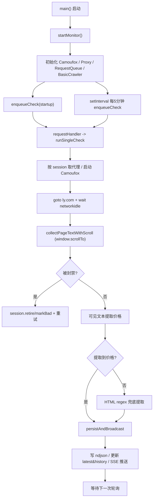

# Crawlee + Camoufox 需求沉淀与函数地图（可复用交接稿）

## 1. 任务目标（到目前为止）
- 目标站点：`ly.com`
- 目标检索：`北京(BJS) -> 三亚(SYX)`，日期 `2026-04-01`，航班号 `CA1345`
- 输出频率：每 `5` 分钟给一个价格结果
- 运行方式：常驻 Web 服务
- 可视要求：抓取时可看到浏览器窗口（可配置）

## 2. 必须具备的能力
- 使用 Crawlee 管理抓取任务与长跑循环
- 使用 Camoufox（隐形 Firefox）
- 代理轮换（Proxy rotation）
- 会话管理（Session pool + cookies + good/bad/retire）
- 反封禁（状态码拦截 + 页面信号识别 + 重试/换 session）
- 提供查询接口（最新结果、历史、手动触发、SSE 推送）

## 3. 关键经验与约束（对话中确认）
- 站点数据可能懒加载，`CA1345` 可能出现在列表底部（“最后一行”）
- 仅靠 `page.content()` 容易漏航班，需优先读可见文本并滚动加载
- 窗口不在最前时，`mouse.wheel` 可能不稳定，改为页面内 `window.scrollTo`
- 配置不要散落在代码里，要集中在一个配置文件（`src/config.js`）
- 源码注释要中文，便于快速维护

## 4. 当前代码结构
- 统一配置入口：[src/config.js](/F:/lake/myCrawleeEngineer/src/config.js)
- 主程序入口：[src/server.js](/F:/lake/myCrawleeEngineer/src/server.js)
- 项目说明：[README.md](/F:/lake/myCrawleeEngineer/README.md)
- 结果输出：`output/flight-price-results.ndjson`

## 5. 配置清单（改哪里）
配置都在 [src/config.js](/F:/lake/myCrawleeEngineer/src/config.js)：
- `server`：端口
- `task`：日期、出发地、到达地、航班号、轮询间隔
- `browser`：是否无头、可视停留、Camoufox 参数
- `crawler`：并发、重试、session pool、queue 名称
- `proxy`：代理池与 geoip
- `antiBlocking`：封禁状态码与关键词
- `extraction`：滚动次数、等待时间、提取窗口/截断长度
- `storage`：输出目录、文件名、history 内存条数
- `timeouts`：导航与 networkidle 超时
- `api`：`/history` 默认与最大限制

### 推荐基线配置（按本次需求）
- `task.flightDate = "2026-04-01"`
- `task.departure = "BJS"`
- `task.arrival = "SYX"`
- `task.flightNo = "CA1345"`
- `task.pollIntervalMinutes = 5`
- `browser.headless = false`（需要可视窗口时）

## 6. 函数位置与作用（快速地图）
函数都在 [src/server.js](/F:/lake/myCrawleeEngineer/src/server.js)：

| 位置 | 函数/对象 | 作用 |
|---|---|---|
| `:48` | `buildLyUrl` | 生成同程查询 URL |
| `:53` | `pickDateFromUrl` | 读取最终 URL 的 `date`，判断是否被跳转 |
| `:69` | `detectBlockedPage` | 页面关键词反封禁判定 |
| `:88` | `extractPriceFromVisibleText` | 主提取：从可见文本中找 `航班号 + 价格` |
| `:132` | `collectPageTextWithScroll` | 页面内滚动采集文本，覆盖底部懒加载 |
| `:184` | `extractPriceByFlightNo` | 兜底提取：从 HTML/脚本字段正则提取 |
| `:252` | `persistAndBroadcast` | 内存更新 + ndjson 落盘 + SSE 推送 |
| `:274` | `runSingleCheck` | 单次抓取主流程（代理、会话、反封禁、提取） |
| `:407` | `enqueueCheck` | 向队列投递一次任务 |
| `:429` | `startMonitor` | 启动监控主循环（keepAlive + 定时入队） |
| `:527` | `stopMonitor` | 优雅停止 |
| `:543` | `GET /health` | 服务与目标配置状态 |
| `:564` | `GET /latest` | 最新结果 |
| `:571` | `GET /history` | 历史结果 |
| `:583` | `POST /trigger` | 手动触发一轮 |
| `:589` | `GET /stream` | SSE 实时推送 |
| `:607` | `main` | 入口：启动 monitor + HTTP 服务 |

## 7. 复现同类程序的最小步骤
1. 先定义统一配置文件（日期/航班/轮询/反封禁/提取参数）
2. 建立 Crawlee `BasicCrawler` + `RequestQueue` + `keepAlive`
3. 单次任务里用 Camoufox 拉页面，恢复 cookies，执行反封禁判断
4. 先“可见文本+滚动”提取，再“HTML 正则”兜底
5. 把结果写入 ndjson，并同步给 `/latest`、`/history`、`/stream`
6. 提供 `/trigger` 便于人工补抓
7. 全部参数从配置读取，业务代码不写死

## 8. 验收标准（建议）
- 服务启动后可访问 `/health`
- 轮询周期符合配置（默认 5 分钟）
- `CA1345` 能在底部懒加载场景被识别
- 浏览器前后台切换时，抓取稳定性不明显下降
- 结果持续落盘且 SSE 能实时收到更新

## 9. 流程图（总览）

