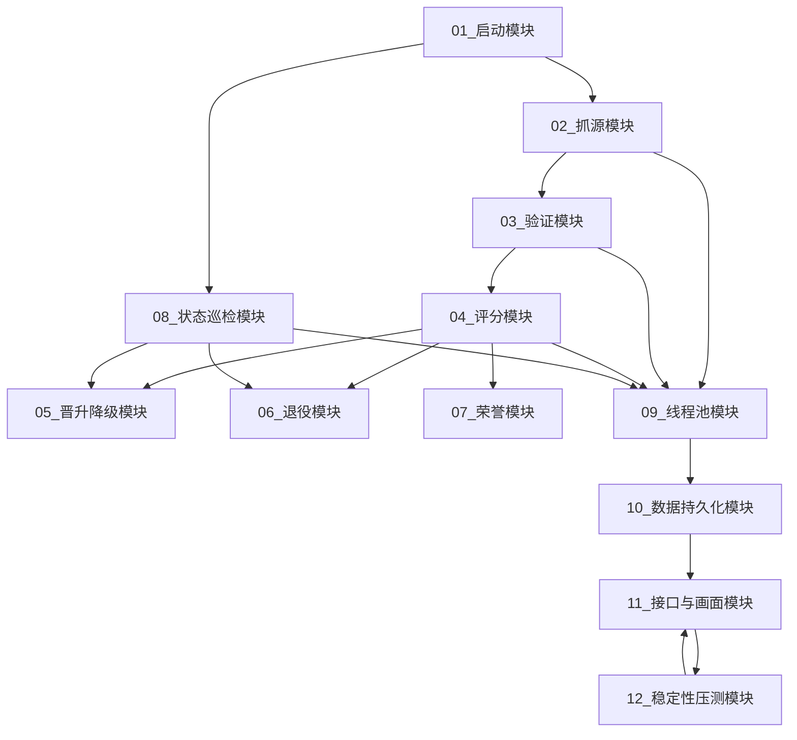

# 图01：ProxyHub 12模块调用关系总览

## 1. 图示

## 2. 中文讲解
1. `01_启动模块` 负责创建运行时对象，装配 DB、线程池、引擎和 HTTP 路由，是所有模块的入口。
2. `02_抓源模块 -> 03_验证模块 -> 04_评分模块` 构成主业务流水线，抓到的代理会被持续验证并写入评分结果。
3. `05_晋升降级/06_退役/07_荣誉` 都是 `04_评分模块` 的结果分支，由评分规则驱动状态变化。
4. `08_状态巡检模块` 是并行补偿通道，周期性修正 `active/reserve/retired` 生命周期，不依赖抓源节奏。
5. `09_线程池模块` 为抓源、验证、评分、巡检提供任务并发和超时恢复机制。
6. `10_数据持久化模块` 统一落库代理画像、事件、日志、荣誉、退役和线程池快照。
7. `11_接口与画面模块` 读取数据库与内存状态，对外提供 API、SSE 和管理页面。
8. `12_稳定性压测模块` 反向调用接口模块做长稳观测，输出时间线与总结报告。

