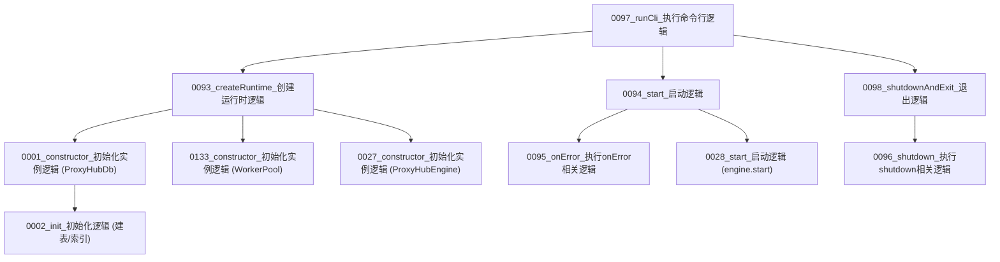

# 图02：模块01_启动模块实现图

## 1. 图示

## 2. 中文讲解
1. 进程入口是 `0097_runCli_执行命令行逻辑`，它先调用 `0093_createRuntime_创建运行时逻辑` 组装运行时依赖。
2. 运行时创建阶段会先进入 `0001_constructor_初始化实例逻辑`，随后 `0002_init_初始化逻辑` 负责建表与索引。
3. 同时创建 `0133_constructor_初始化实例逻辑`（线程池）和 `0027_constructor_初始化实例逻辑`（引擎），形成完整后端骨架。
4. `0094_start_启动逻辑` 启动 HTTP 服务；若监听失败则由 `0095_onError_执行onError相关逻辑` 兜底。
5. 服务监听成功后异步调用 `0028_start_启动逻辑` 启动抓源/巡检/快照三类调度器。
6. 退出时统一通过 `0098_shutdownAndExit_退出逻辑`，顺序执行 `0096_shutdown_执行shutdown相关逻辑`，确保服务、引擎、线程池、数据库按顺序释放。

