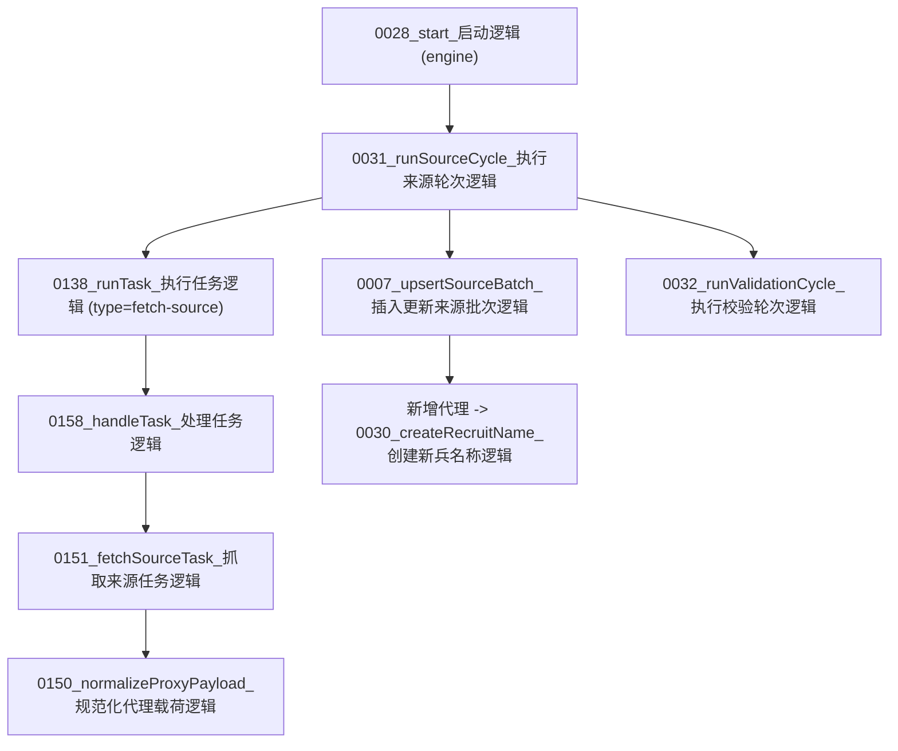

# 图03：模块02_抓源模块实现图

## 1. 图示

## 2. 中文讲解
1. 抓源调度由 `0028_start_启动逻辑` 注册的定时器触发，核心函数是 `0031_runSourceCycle_执行来源轮次逻辑`。
2. 引擎不直接拉远端源，而是把任务交给线程池：`0138_runTask_执行任务逻辑(type=fetch-source)`。
3. worker 侧用 `0158_handleTask_处理任务逻辑` 分发，再进入 `0151_fetchSourceTask_抓取来源任务逻辑` 请求代理源。
4. 抓到数据后先走 `0150_normalizeProxyPayload_规范化代理载荷逻辑`，统一 IP/端口/协议并做去重。
5. 标准化结果回到主线程后进入 `0007_upsertSourceBatch_插入更新来源批次逻辑`，对已存在代理做触达更新，对新代理插入新兵记录。
6. 新增代理命名通过 `0030_createRecruitName_创建新兵名称逻辑`，避免昵称冲突。
7. 抓源轮次结束前会立即调用 `0032_runValidationCycle_执行校验轮次逻辑`，确保“抓源后马上验证”。

对模块02提问，多久去抓一次源，这个时间是基于什么定的？

模块02（抓源）的频率是固定间隔，当前默认是每 120000ms（2分钟）抓一次。

配置来源：scheduler.sourceSyncMs
见 config.js
默认值：120_000
可覆盖方式：环境变量 PROXY_HUB_SOURCE_SYNC_MS
实际调度位置：引擎启动时先立即抓一次，然后 setInterval 按该值循环抓
见 engine.js
“基于什么定的”这点在代码里是：基于配置参数，不是自适应算法。
也就是说当前不是根据实时负载自动计算，而是人为设定的轮询周期。通常需要结合这几个量一起调：

代理源更新速度（太快会浪费、太慢会不新鲜）
线程池/验证吞吐（workers、maxValidationPerCycle）
外部源限流风险（抓太频繁可能被限）
如果你愿意，我可以按你当前机器和代理规模，给一个更合理的 sourceSyncMs 建议值区间。

>>所有抓到的对象都会进入DB么？还是怎样？

不是“原始抓到的全部对象都直接入库”，而是分两步：

先过滤标准化
在 worker 的 0150_normalizeProxyPayload_规范化代理载荷逻辑 里，只保留合法 ip/port 且协议在允许列表（默认 http/https/socks5）的项，并按 ip:port:protocol 去重。
代码位置：worker.js

再入库（新增或触达更新）
标准化后的每一条都会进 0007_upsertSourceBatch_插入更新来源批次逻辑：

不存在：INSERT 新记录
已存在：UPDATE 触达时间/来源等字段（不是重复插入）
代码位置：db.js、调用在 engine.js
补充：

入库不等于立即校验。校验还受每轮上限 maxValidationPerCycle 控制。
退役代理也会留在 DB，不会因为后续抓源缺失就自动删除。

>>新兵入列命名的的逻辑是怎样的？名称构成。(哪个函数写的？)

已处理 24s
新兵命名逻辑在这两个函数里：

0079_generateRecruitName_新兵名称逻辑（真正生成名）
文件：naming.js

0030_createRecruitName_创建新兵名称逻辑（引擎调用入口）
文件：engine.js

名称构成是：

主格式：前缀-代号-两位序号
由 0078_buildName_名称逻辑 生成：
randomPick(PREFIXES) + "-" + randomPick(CODENAMES) + "-" + randomSerial()
例子：苍隼-北辰-07
唯一性与兜底：

先尝试 10 次主格式，逐次检查 isUniqueName（底层是 DB 的 isDisplayNameAvailable）。
若还冲突，再尝试 20 次加短码后缀：
前缀-代号-序号-XX（XX 来自 0077_shortCode_执行shortCode相关逻辑 的 2 位十六进制大写码）。
仍失败就抛错：无法生成唯一的新兵昵称。

>>没有检测过的ip也会赋予一个新兵的名字么？

会。
只要抓源后是“新插入”记录，即使还没做校验，也会先分配新兵名。

流程是：

抓源后 engine 调用 upsertSourceBatch，并传入 () => this.createRecruitName()
见 engine.js

upsertSourceBatch 对不存在的 ip:port:protocol 执行插入时会写 display_name（调用命名函数），且默认 lifecycle='candidate'、rank='新兵'
见 db.js

所以“未检测过的 IP”只要被抓源并入库，就已经有名字了；校验是后续步骤。

