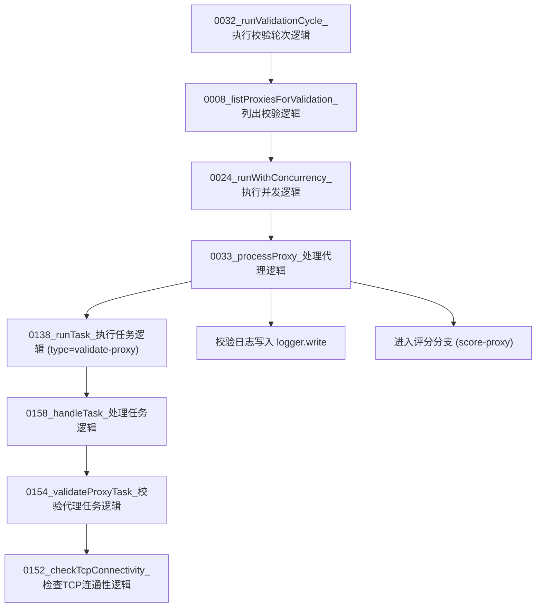

# 图04：模块03_验证模块实现图

## 1. 图示

## 2. 中文讲解
1. `0032_runValidationCycle_执行校验轮次逻辑` 会先从数据库拿待校验代理：`0008_listProxiesForValidation_列出校验逻辑`。
2. 为了避免瞬时压力过高，轮次使用 `0024_runWithConcurrency_执行并发逻辑` 控制并发上限。
3. 每个代理进入 `0033_processProxy_处理代理逻辑` 后，先发起 `validate-proxy` 任务给线程池。
4. worker 侧由 `0158_handleTask_处理任务逻辑` 分流到 `0154_validateProxyTask_校验代理任务逻辑`。
5. 真正的连通性判定由 `0152_checkTcpConnectivity_检查TCP连通性逻辑` 完成，输出 `ok/reason/latencyMs`。
6. 主线程拿到验证结果后先写日志，再进入后续评分通道，不在验证阶段直接做军衔/退役决策。

