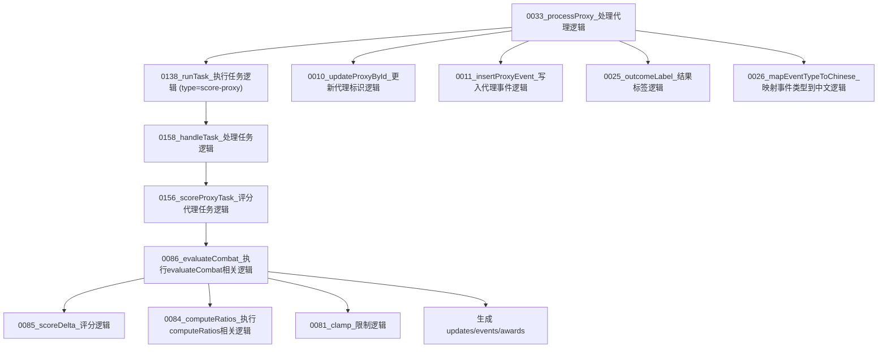

# 图05：模块04_评分模块实现图

## 1. 图示

## 2. 中文讲解
1. `0033_processProxy_处理代理逻辑` 在校验后会继续提交 `score-proxy` 任务给 worker。
2. `0156_scoreProxyTask_评分代理任务逻辑` 会结合校验结果给出一个离散 outcome（success/blocked/timeout/network_error）。
3. 真正业务评分在主线程通过 `0086_evaluateCombat_执行evaluateCombat相关逻辑` 完成，核心是规则可控、可解释。
4. 评分明细包括 `0085_scoreDelta_评分逻辑`（积分增减）和 `0084_computeRatios_执行computeRatios相关逻辑`（窗口成功率/blocked 比例）。
5. `0081_clamp_限制逻辑` 用于约束健康与纪律分值边界，避免越界污染画像。
6. 评分结果输出 `updates/events/awards` 三类产物，随后落库到 `proxies` 与 `proxy_events`。
7. 日志展示侧会经过 `0025_outcomeLabel_结果标签逻辑` 和 `0026_mapEventTypeToChinese_映射事件类型到中文逻辑`，形成统一中文运营语义。

