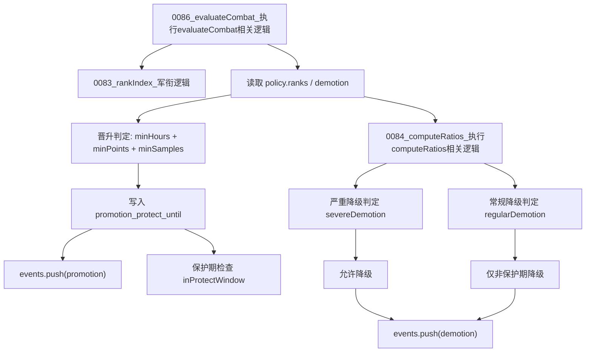

# 图06：模块05_晋升降级模块实现图

## 1. 图示

## 2. 中文讲解
1. 晋升降级都在 `0086_evaluateCombat_执行evaluateCombat相关逻辑` 内统一计算，避免分散判断导致状态冲突。
2. 晋升依据当前军衔索引 `0083_rankIndex_军衔逻辑`，向上一级读取门槛（服役时长、战功积分、样本数）。
3. 满足门槛后触发晋升，并写入 `promotion_protect_until`，这是一段“晋升保护期”。
4. 降级分两类：严重降级（短时间 blocked 比例过高）与常规降级（常规窗口表现变差或健康过低）。
5. 保护期策略是关键：常规降级受保护期限制，严重降级不受限制。
6. 每次晋升/降级都会写入事件，后续由事件流和日志页面展示给运营人员。

