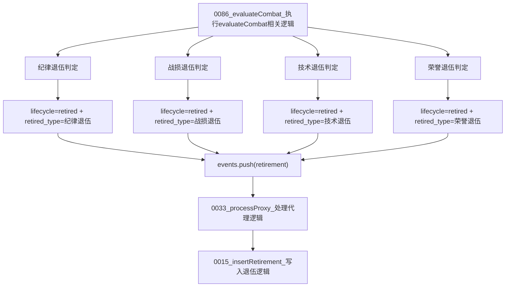

# 图07：模块06_退役模块实现图

## 1. 图示

## 2. 中文讲解
1. 退役判定在评分阶段完成，不是单独线程异步“后补”。
2. 纪律退伍通常来自纪律分过低或无效反馈累计过高；战损退伍来自低健康+高 blocked 比例；技术退伍来自长期成功率过低；荣誉退伍来自高服役与高战绩达标。
3. 一旦命中任何退役条件，生命周期会切换到 `retired`，并记录 `retired_type`。
4. `0086_evaluateCombat_执行evaluateCombat相关逻辑` 只给出“将要退役”的状态变化。
5. 真正入台账在 `0033_processProxy_处理代理逻辑` 中调用 `0015_insertRetirement_写入退伍逻辑`，保证事件与退役记录强一致。
6. 退役事件随后会出现在 `/v1/proxies/retirements` 与运营页面“退伍台账”中。

