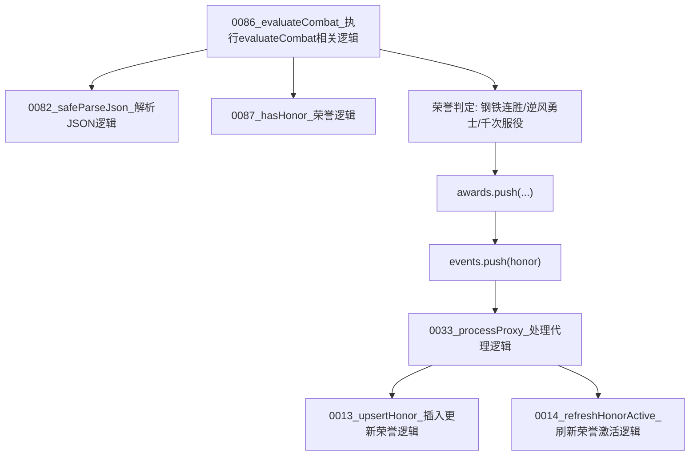

# 图08：模块07_荣誉模块实现图

## 1. 图示

## 2. 中文讲解
1. 荣誉系统是评分子系统，不是独立外部任务。
2. `0082_safeParseJson_解析JSON逻辑` 先恢复历史荣誉和近期窗口数据，避免坏数据导致流程中断。
3. `0087_hasHonor_荣誉逻辑` 用于防止重复授勋，同一荣誉不会重复插入。
4. 达到门槛后写入 `awards` 并生成 `honor` 事件，后续供日志/事件流展示。
5. `0033_processProxy_处理代理逻辑` 中调用 `0013_upsertHonor_插入更新荣誉逻辑` 做幂等写入。
6. `0014_refreshHonorActive_刷新荣誉激活逻辑` 负责实时激活态维护，例如连胜荣誉在条件不再满足时可转为历史状态。

