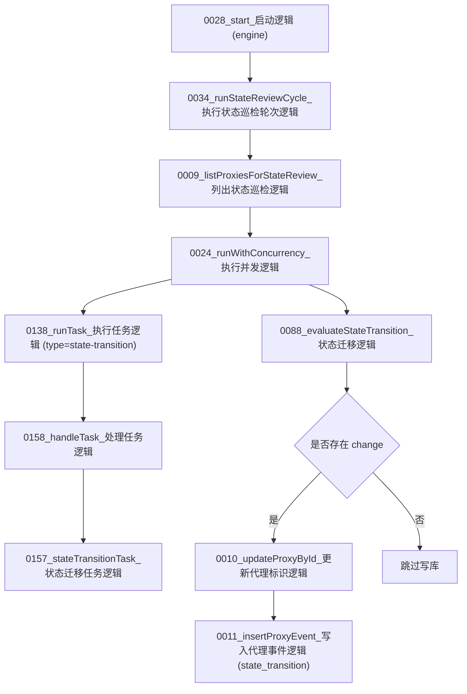

# 图09：模块08_状态巡检模块实现图

## 1. 图示

## 2. 中文讲解
1. 状态巡检由独立定时器驱动，节奏来自 `scheduler.stateReviewMs`。
2. 每轮先取 `active/reserve/candidate` 代理，再用并发执行器批处理。
3. 每个对象会先走 `state-transition` worker 任务，再由 `0088_evaluateStateTransition_状态迁移逻辑` 进行规则判断。
4. 仅当 `change` 存在时才落库，避免无意义更新影响审计和查询效率。
5. 巡检主要修复生命周期偏移，比如 `active -> reserve` 或 `reserve -> active`，同时也可触发纪律退役。
6. 这个模块和评分模块互补：评分是“每次样本驱动”，巡检是“周期一致性修正”。

