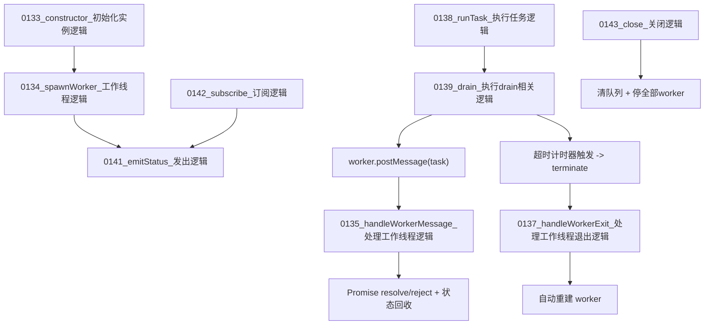

# 图10：模块09_线程池模块实现图

## 1. 图示

## 2. 中文讲解
1. `0133_constructor_初始化实例逻辑` 在启动时创建固定大小 worker 集群，并绑定消息、错误、退出事件。
2. 上层模块提交任务走 `0138_runTask_执行任务逻辑`，任务进入队列等待 `0139_drain_执行drain相关逻辑` 分配到空闲 worker。
3. worker 完成后由 `0135_handleWorkerMessage_处理工作线程逻辑` 回收状态并兑现 Promise。
4. 每个任务都有超时保护；超时后会 terminate worker，并在 `0137_handleWorkerExit_处理工作线程退出逻辑` 里自动拉起新 worker。
5. 状态事件统一通过 `0141_emitStatus_发出逻辑` 广播，可被 SSE 与监控模块实时消费。
6. 关闭阶段使用 `0143_close_关闭逻辑`，保证队列和运行中任务都收到失败回调，不留悬空 Promise。

