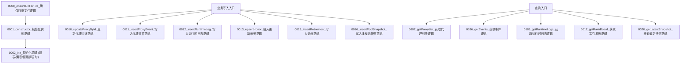

# 图11：模块10_数据持久化模块实现图

## 1. 图示

## 2. 中文讲解
1. 数据层入口从 `0001_constructor_初始化实例逻辑` 开始，先通过 `0000_ensureDirForFile_确保目录文件逻辑` 确保数据库目录存在。
2. `0002_init_初始化逻辑` 负责建全部业务表与索引，包括 `proxies/proxy_events/runtime_logs/honors/retirements/pool_snapshots`。
3. 业务主链路写入统一通过 DB 类方法，不允许上层散写 SQL，便于维护事务一致性。
4. `0016_insertPoolSnapshot_写入线程池快照逻辑` 还承担历史清理职责，按保留天数删除过期快照。
5. 读接口同样统一在 DB 层，前端与 API 只消费 `get*` 方法，形成清晰分层。
6. 这种设计把“规则计算”和“数据持久化”隔离开，降低改规则时对 SQL 的耦合风险。

