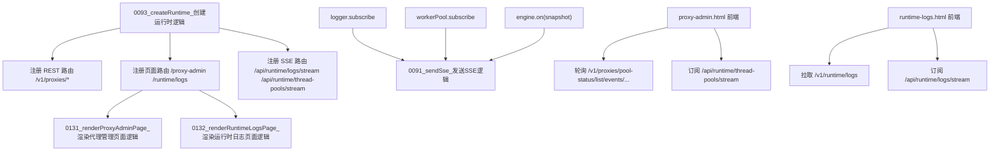

# 图12：模块11_接口与画面模块实现图

## 1. 图示

## 2. 中文讲解
1. 接口模块在 `0093_createRuntime_创建运行时逻辑` 中完成路由挂载，分为 REST、页面和 SSE 三类。
2. 页面渲染入口分别是 `0131_renderProxyAdminPage_渲染代理管理页面逻辑` 与 `0132_renderRuntimeLogsPage_渲染运行时日志页面逻辑`。
3. SSE 统一通过 `0091_sendSse_发送SSE逻辑` 发包，消息来源有三路：运行日志、线程池状态、引擎快照。
4. `/proxy-admin` 页面采用“轮询 + SSE”混合策略，轮询拉取全量看板，SSE补充实时线程池变化。
5. `/runtime/logs` 页面采用“初始加载 + SSE增量”策略，先拉历史日志再持续插入新日志。
6. 接口模块不计算业务规则，只负责聚合现有状态并对外暴露，这样更稳定、可替换性更高。

