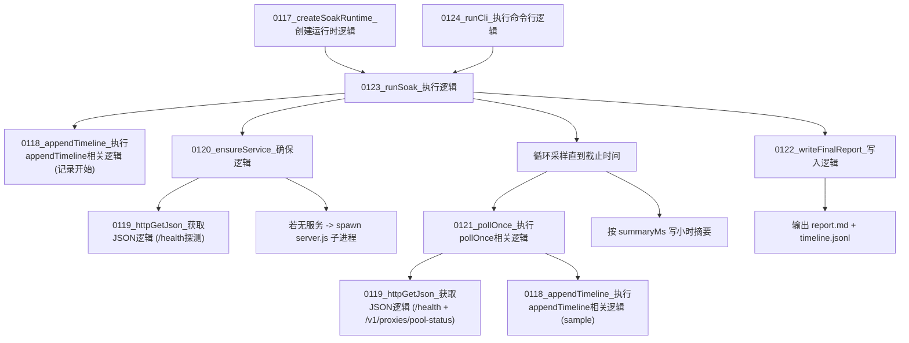

# 图13：模块12_稳定性压测模块实现图

## 1. 图示

## 2. 中文讲解
1. 压测入口是 `0124_runCli_执行命令行逻辑`，内部驱动 `0123_runSoak_执行逻辑`。
2. `0120_ensureService_确保逻辑` 先探活，如果服务未启动会自动拉起 `server.js` 子进程。
3. 压测主循环周期执行 `0121_pollOnce_执行pollOnce相关逻辑`，拉取健康状态和线程池状态。
4. 每个采样点都通过 `0118_appendTimeline_执行appendTimeline相关逻辑` 写入时间线，便于回放故障过程。
5. 运行中会累计可用率、队列峰值、忙碌线程峰值、失败任务峰值、异常退出次数等关键指标。
6. 结束后调用 `0122_writeFinalReport_写入逻辑` 输出 Markdown 报告和 JSONL 时间线，形成可审计的稳定性证据。

