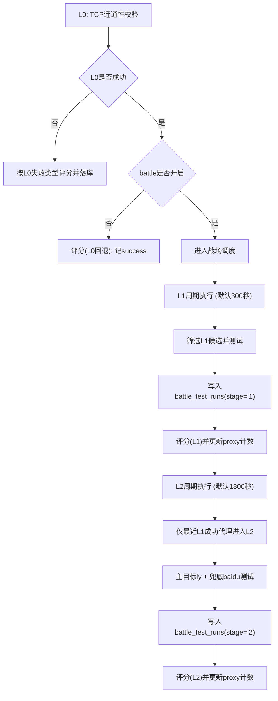

# 图14：模块13_L0_L1_L2测试目标与判定说明

## 1. 范围与结论
本文说明 ProxyHub 当前版本的三层测试体系（L0/L1/L2）在代码中的真实目标、判定逻辑与落库方式。

结论先行：
1. `L0` 是基础连通性闸门（TCP 级别）。
2. `L1` 是通用出网真实性测试（IP 回显接口）。
3. `L2` 是业务场景实战测试（`ly-flight-main`）。
4. `baidu` 存在，名称为 `baidu-home`，角色是 `L2 fallback`（兜底目标），不是独立层级。

## 2. 分层目标总览
| 层级 | 核心目标 | 测试动作 | 成功标准 | 主要失败类型 |
|---|---|---|---|---|
| L0 | 快速淘汰不可连代理 | 对 `ip:port` 做 TCP 连接 | `connect_ok` | `timeout`、`network_error`（含连接错误） |
| L1 | 验证可用代理具备稳定出网能力 | 通过代理请求 `httpbin/ip`、`ipify` | 至少一个目标 2xx 且可解析 IP 字段 | `blocked`、`timeout`、`invalid_feedback`、`network_error` |
| L2 | 验证真实业务页面可访问与内容有效 | 先打 `ly-flight-main`，再打 `baidu-home` | 主目标 `ly` 响应 2xx 且内容断言通过 | `blocked`、`timeout`、`invalid_feedback`、`network_error` |

## 3. 目标站点与角色
### 3.1 L1 目标
1. `httpbin/ip`
2. `ipify`

L1 的作用是证明代理不仅端口可连，而且能完成基础 HTTP 请求与有效载荷解析。

### 3.2 L2 主目标
1. `ly-flight-main`：`https://www.ly.com/flights/itinerary/oneway/BJS-SYX?date=2026-04-01`

L2 主目标用于模拟真实业务访问，对抗“能连通但页面不可用”的假阳性代理。

### 3.3 L2 兜底目标
1. `baidu-home`：`https://www.baidu.com`

`baidu-home` 用于兜底观测出网稳定性与页面可读性，记录 `fallback_ok/fallback_assert_failed` 等信息。

注意：L2 最终 outcome 以主目标结果为主，兜底成功不会把主目标失败改判为成功。

## 4. 执行顺序与调度

默认周期参数：
1. `L1`：`300000ms`（5 分钟）
2. `L2`：`1800000ms`（30 分钟）

## 5. 候选筛选规则
### 5.1 L1 候选
1. 优先 `active/reserve`。
2. 按 `last_battle_checked_at` 最久未测优先。
3. 可按 `candidateQuota` 混入部分 `candidate`。

### 5.2 L2 候选
1. 必须在 `lookbackMinutes`（默认 10 分钟）内存在 `L1 success` 记录。
2. `retired` 不参与 L2。
3. 仍按 `last_battle_checked_at` 与生命周期优先级排序。

## 6. 判定细则
### 6.1 L0 判定
1. 连接成功：`connect_ok`。
2. 超时：`timeout`。
3. 其他连接错误：归类为 `network_error`。

### 6.2 L1 判定
1. 请求错误按异常分类为 `timeout/network_error`。
2. 命中封锁信号（状态码或关键词）判 `blocked`。
3. 非 2xx 或 JSON/IP 字段缺失判 `invalid_feedback`。
4. 至少一个目标成功则整轮 `outcome=success`。

### 6.3 L2 判定
1. 主目标 `ly` 必须 2xx 且内容命中 `ly.com/flight/航班/机票` 关键词。
2. 兜底 `baidu` 需 2xx 且正文长度大于 20 才算 `fallback_ok`。
3. 主目标失败时，兜底成功不会把本轮 outcome 提升为 success，仅补充诊断信息。

## 7. 数据落库与可审计字段
### 7.1 明细表：`battle_test_runs`
每次 L1/L2 子目标请求会写入一条记录，关键字段：
1. `timestamp`
2. `proxy_id`
3. `stage`（`l1`/`l2`）
4. `target`（如 `ly-flight-main`、`baidu-home`）
5. `outcome`
6. `status_code`
7. `latency_ms`
8. `reason`
9. `details_json`

### 7.2 聚合字段：`proxies`
评分后会更新代理聚合状态，关键字段：
1. `last_battle_checked_at`
2. `last_battle_outcome`
3. `battle_success_count`
4. `battle_fail_count`
5. `success_count/block_count/timeout_count/network_error_count/invalid_feedback_count`
6. `health_score`、`discipline_score`、`combat_points`
7. `rank`、`lifecycle`（并可能触发晋升/降级/退役事件）

## 8. 配置项与环境变量映射
1. `PROXY_HUB_BATTLE_ENABLED`：是否启用 L1/L2。
2. `PROXY_HUB_BATTLE_L1_MS`：L1 周期。
3. `PROXY_HUB_BATTLE_L2_MS`：L2 周期。
4. `PROXY_HUB_BATTLE_L1_MAX`：每轮 L1 最大代理数。
5. `PROXY_HUB_BATTLE_L2_MAX`：每轮 L2 最大代理数。
6. `PROXY_HUB_BATTLE_CANDIDATE_QUOTA`：L1 中 candidate 占比。
7. `PROXY_HUB_BATTLE_L2_LOOKBACK_MINUTES`：L2 回看窗口。
8. `PROXY_HUB_BATTLE_L1_TIMEOUT_MS`：L1 单请求超时。
9. `PROXY_HUB_BATTLE_L2_TIMEOUT_MS`：L2 单请求超时。

## 9. 代码锚点（便于复核）
1. `apps/proxy-pool-service/src/config.js`
2. `apps/proxy-pool-service/src/engine.js`
3. `apps/proxy-pool-service/src/worker.js`
4. `apps/proxy-pool-service/src/db.js`
5. `apps/proxy-pool-service/src/rank.js`

