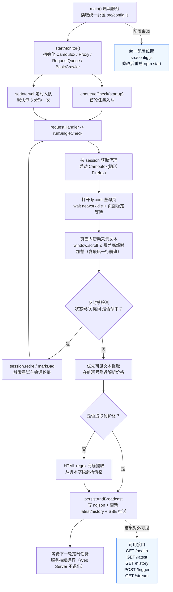

# 流程图（Mermaid）

```mermaid
flowchart TD
    A["main() 启动服务<br/>读取统一配置 src/config.js"] --> B["startMonitor()<br/>初始化 Camoufox / Proxy / RequestQueue / BasicCrawler"]
    B --> C["enqueueCheck(startup)<br/>首轮任务入队"]
    B --> D["setInterval 定时入队<br/>默认每 5 分钟一次"]
    C --> E["requestHandler -> runSingleCheck"]
    D --> E

    E --> F["按 session 获取代理<br/>启动 Camoufox(隐形 Firefox)"]
    F --> G["打开 ly.com 查询页<br/>wait networkidle + 页面稳定等待"]
    G --> H["页面内滚动采集文本<br/>window.scrollTo 覆盖底部懒加载（含最后一行航班）"]

    H --> I{"反封禁检测<br/>状态码/关键词 是否命中？"}
    I -- "是" --> J["session.retire / markBad<br/>触发重试与会话轮换"]
    J --> E
    I -- "否" --> K["优先可见文本提取<br/>在航班号附近解析价格"]

    K --> L{"是否提取到价格？"}
    L -- "是" --> M["persistAndBroadcast<br/>写 ndjson + 更新 latest/history + SSE 推送"]
    L -- "否" --> N["HTML regex 兜底提取<br/>从脚本字段解析价格"]
    N --> M

    M --> O["等待下一轮定时任务<br/>服务持续运行（Web Server 不退出）"]

    P["可用接口<br/>GET /health<br/>GET /latest<br/>GET /history<br/>POST /trigger<br/>GET /stream"]:::note
    M -. "结果对外可见" .-> P

    Q["统一配置位置<br/>src/config.js<br/>修改后重启 npm start"]:::note
    A -. "配置来源" .-> Q

    classDef note fill:#eef7ff,stroke:#3b82f6,color:#0f172a,stroke-width:1px;
```

